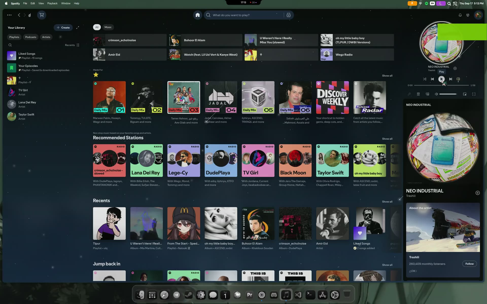

# Revo Shell Dotfiles

Revo Shell its place to Add all ypur quickShells in one place

if you share any video to this dot files in tik tok or insta pleas mention me : @_flz4

## Showcase

[](https://github.com/vzbc/revo-shell/raw/main/showcase/showcase.mp4)

[▶ Watch showcase video](https://github.com/vzbc/revo-shell/raw/main/showcase/showcase.mp4)

## Layout

| Path | Deploy target |
|------|----------------|
| `hypr/` | `~/.config/hypr` |
| `quickshell/` | `~/.config/quickshell` |
| `wallpapers/` | `~/.config/wallpapers` |
| `rofi/` | `~/.config/rofi` |
| `kitty/` | `~/.config/kitty` |
| `qs-gui-installer/` | **run this (GUI)** |

## Install (GUI — recommended)

```bash
git clone https://github.com/vzbc/revo-shell.git revo-shell
cd revo-shell/qs-gui-installer
pip install -r requirements.txt
python main.py
```

The GUI **full install** does everything:

1. System packages (pacman/apt/dnf) for **every** shell  
2. **rofi + kitty** installed if missing (`--needed`)  
3. AUR (`quickshell-git`, `awww`, fonts, …) when available  
4. Python deps (`pip --user`, Q1/nibrasshell requirements)  
5. `git clone` monorepo → deploy `hypr/`, `quickshell/`, `wallpapers/`, **`rofi/`, `kitty/`**  
6. Rewrite hardcoded `/home/revo` → `$HOME`  
7. **Build** CMake shells (`shell` caelestia + `imported-1789667132` Clavis)  
8. Enable pipewire / NetworkManager / bluetooth  
9. Per-file backup — existing configs are never blindly deleted  

Logs: `~/.local/state/qs-gui-installer/install.log`

Enter your sudo password in Stage 4 → **Install Now**.

## Install (CLI)

```bash
./install.sh
```

Same steps as the GUI (packages → deploy → build → services).

## After clone — repo URL

Already set in `qs-gui-installer/main.py`:

```python
DOTFILES_REPO_URL = "https://github.com/vzbc/revo-shell.git"
```

## Safety

- `.env` and API keys are **gitignored** (never commit secrets)  
- Existing user files: backed up before merge  
- Backups: `~/.config/revo-shell-backup-*` and `/tmp/dotfiles_backup`  

## Shells

Launch after install:

```bash
qs -p ~/.config/quickshell/lucid
qs -p ~/.config/quickshell/brain_shell
# …or pick any folder under ~/.config/quickshell
```

C++ shells (`shell`, `imported-1789667132`) are built during install.
