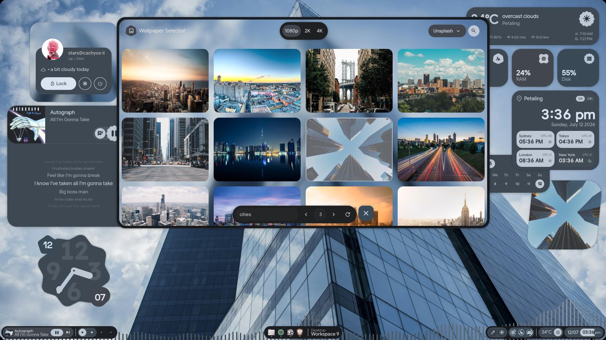
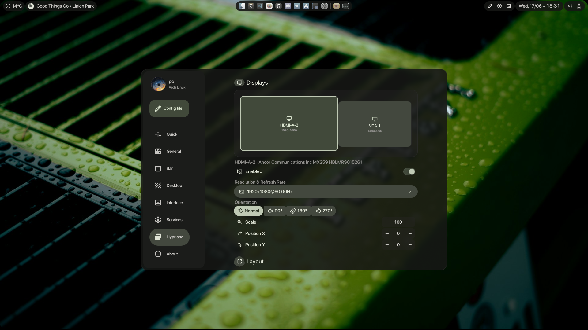
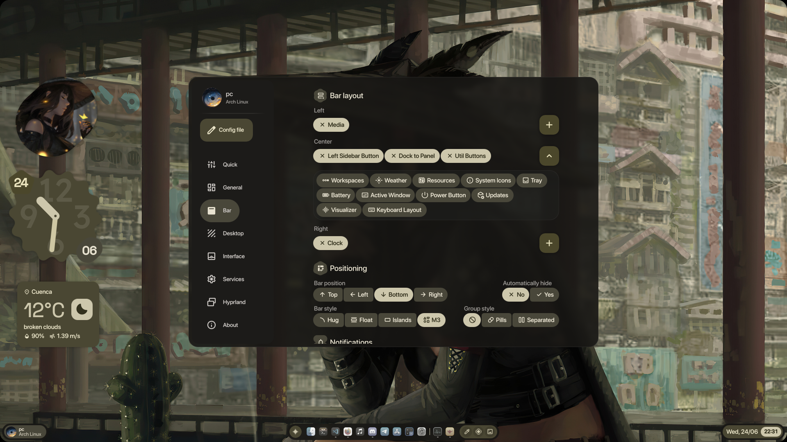

<div align="center">

# 💠 end4-pC

**[illogical-impulse](https://github.com/end-4/dots-hyprland)（作者：[@end-4](https://github.com/end-4)）的个人分支**
由 **pctrade** 定制并维护

[English](README.md) | [简体中文](README.zh-CN.md) | [日本語](README.ja.md)

</div>

---

## 🎬 展示

<p align="center">
  <a href="https://www.youtube.com/watch?v=o0Vsh7eVchs">
    
  </a>
</p>

</div>

---

## 📸 截图
<div align="center">

| 🎵 歌词 | 🖼️ 在线壁纸 |
|:---:|:---:|
|  |  |
| 🪟 桌面小组件 | 🔧 Hyprland 配置 |
|  |  |
| ⚙️ 可配置的状态栏 | ✨ 以及更多功能 |
|  |  |

</div>

---

## ⚡ 安装

> [!NOTE]
> 此分支会独立管理自己的配置文件夹，**不会**覆盖或修改任何现有设置。不过，它要求已安装并正在运行 [illogical-impulse](https://github.com/end-4/dots-hyprland)。

```bash
cd ~/.config/quickshell/
git clone https://github.com/pctrade/end4-pC.git
killall qs 2>/dev/null; qs -c end4-pC > /dev/null 2>&1 & disown
```

### 🔧 设为默认 shell（可选）

如果你喜欢它，并希望它默认加载以取代 `ii`，请编辑：

```bash
~/.config/hypr/hyprland/variables.lua
```

将这一行：

```lua
hl.env("qsConfig", "ii")
```

改为：

```lua
hl.env("qsConfig", "end4-pC")
```

> [!TIP]
> 保存后，重启 Hyprland 或运行 `hyprctl reload` 即可应用更改。

---

### ⚙️ 设置快捷键

要打开设置面板，请将以下内容添加到 Hyprland 配置中：

```lua
hl.bind("SUPER + escape", hl.dsp.global("quickshell:settingsToggle"), {description = "Toggle settings"})
```

> **注意：** 设置是一个覆盖面板，而不是普通窗口，因此 `Super + Q` 无法将其关闭。请使用同一个快捷键进行切换，或按 `Escape`。

## 🙏 致谢

衷心感谢促成此项目的人们：

- **[@end-4](https://github.com/end-4)** — 创建了原始的 [dots-hyprland](https://github.com/end-4/dots-hyprland) / illogical-impulse shell。这个 dotfiles 项目堪称杰作 🫡
- **[@gh0stzk](https://github.com/gh0stzk)** — 提供了天气 API 集成，让天气小组件得以实现 🙌
- **[@StarS2112](https://github.com/StarS2112)** — 展示了此分支 🙌

---

<div align="center">

用 ❤️ 制作——欢迎自由分支并打造属于你自己的版本

</div>
