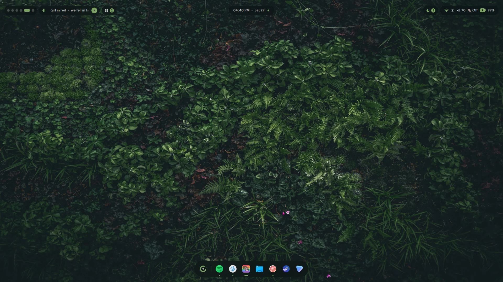
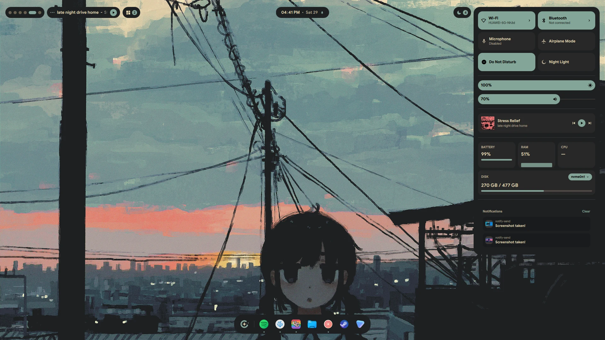
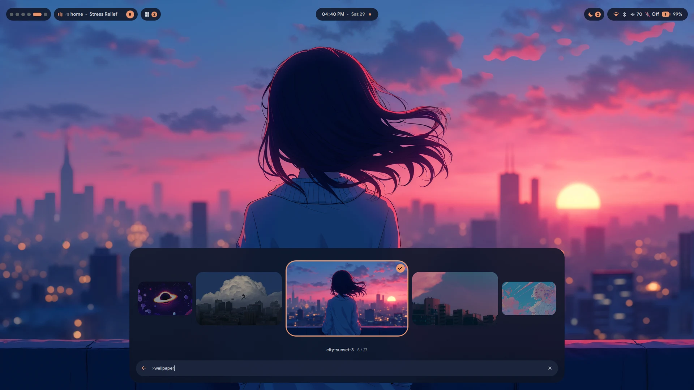
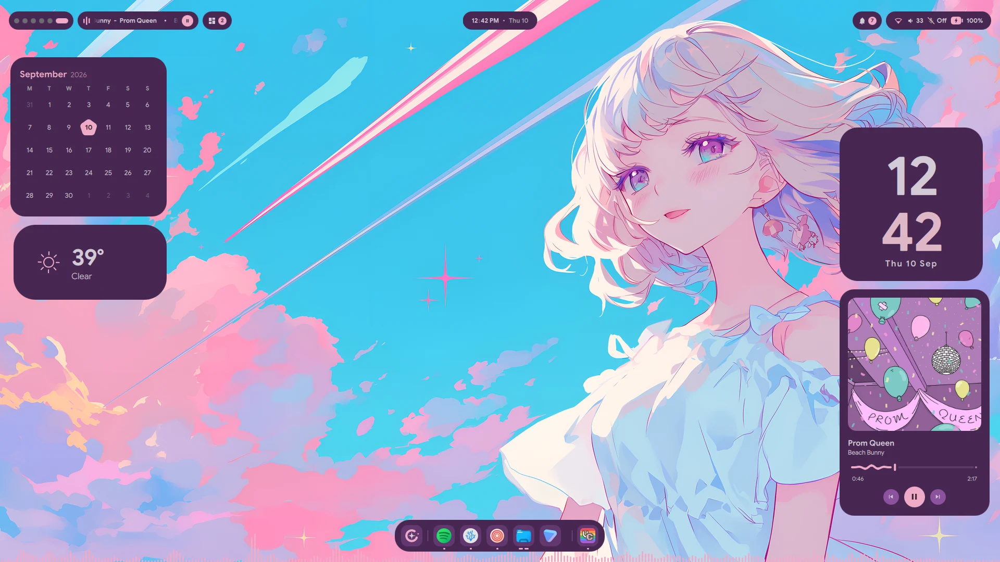
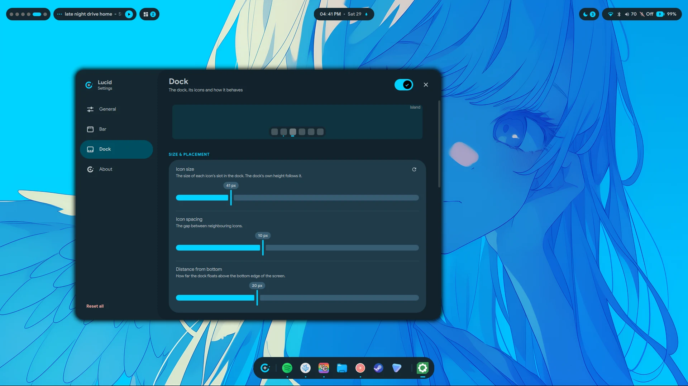

<div align="center">


# Lucid

**A Material 3 Expressive desktop shell for Hyprland, built on [Quickshell](https://quickshell.org).**

A bar, a dock that morphs into a launcher, desktop widgets, a lock screen,
an emoji picker, a screenshot tool and a settings app — themed together from
your wallpaper.

<p>
  <a href="https://github.com/Sn3akyy1/lucid-shell/commits/main"></a>
  <a href="https://github.com/Sn3akyy1/lucid-shell/stargazers"></a>
  <a href="https://github.com/Sn3akyy1/lucid-shell/releases"></a>
  
  <a href="LICENSE"></a>
</p>

<p>
  
  
  
  <a href="https://quickshell.org"></a>
</p>



</div>

---

> **v1.0.0 — the first stable release.** It's what I use daily. Everything that
> landed in it is in the [changelog](CHANGELOG.md). Rough edges are still
> possible and bug reports are welcome.

## Install

Lucid installs to `~/.config/quickshell` and needs **Arch Linux** and
**Hyprland**. Three commands:

```sh
git clone https://github.com/Sn3akyy1/lucid-shell.git
cd lucid-shell
./install.sh
```

That's it — the installer does the rest:

1. **Checks your system** — refuses to run anywhere it can't finish the job,
   rather than leaving you half-installed.
2. **Installs dependencies** — finds `paru` or `yay` and uses it, falling back
   to `pacman` for repo packages. It lists everything and asks before touching
   your system. Say no and it carries on, telling you which features won't work.
   This includes the apps Lucid ships pinned to the dock — several GB, mostly
   from the AUR. `--no-apps` skips them.
3. **Copies the shell** to `~/.config/quickshell`, moving any existing config to
   `~/.config/quickshell.backup-<timestamp>` first.
4. **Sets up Hyprland** — `hyprland.lua` and its modules: the keybinds, the
   window and layer rules, blur, animations, and an autostart that launches the
   shell on login. If you already have a config it is backed up and you are
   asked first; `--no-hypr` keeps yours untouched.
5. **Sets up theming** — the palettes, the wallpaper hook, and the matugen
   template. An existing `matugen/config.toml` is appended to, never replaced.
6. **Applies the look** — kitty's colours and its fish shell, the starship
   prompt (wired into `.bashrc`, `.zshrc` and `config.fish`), the
   VSCode/VSCodium Matugen theme,
   and the GTK theme: `adw-gtk3-dark` with the FairyWren icons, written to
   `gsettings` and to both `gtk-3.0` and `gtk-4.0` `settings.ini`.
   `--no-look` skips this.
7. **Pins the dock** — reads your installed `.desktop` files and pins the real
   apps, so the dock is never a row of blank letter tiles.
8. **Offers to restart** a running instance onto the new files.

Then reload Hyprland so the new binds and rules take effect:

```sh
hyprctl reload
```

Or log out and back in, which picks up the autostart too. To start the shell by
hand in the meantime, run `qs`.

Set a wallpaper from **Settings → General** on first run — that's what generates
your colour palette.

### Updating

Pull and re-run. Your settings, pinned apps, reminders, Shazam history and API
keys are carried forward into the new install:

```sh
git pull
./install.sh
```

### Older versions

`v0.57 beta` is a tag, so it stays exactly where it is:

```sh
git clone --branch v0.57 https://github.com/Sn3akyy1/lucid-shell.git
```

It is on the [releases page](https://github.com/Sn3akyy1/lucid-shell/releases)
too, as a source archive. Nothing carries over between the two — v1.0.0 moved
enough that it is worth installing fresh.

### Installer options

| Flag | What it does |
| --- | --- |
| `--no-theming` | Skips the palette layer. Leaves `~/.config/lucid` and `~/.config/matugen` alone — use this if you already have a matugen setup you don't want touched. |
| `--no-hypr` | Keeps your Hyprland config. Lucid's binds, window rules, blur and autostart are not installed. |
| `--no-apps` | Doesn't install the apps the dock ships pinned (Zen, VSCodium, Spotify, Vesktop, Files, Steam, Proton VPN). The dock then pins whatever equivalents you already have. |
| `--no-look` | Doesn't touch `kitty.conf`, `starship.toml`, your shell rc files, VSCode settings, or the GTK theme and icons. |
| `--with-hypr` | Reinstalls Lucid's Hyprland config even when one is already in place. |
| `--skip-deps` | Never installs packages, just reports what's missing. |
| `-y`, `--yes` | Accept every prompt. |

Re-running the installer is how you update. It moves your existing
`~/.config/quickshell` to `~/.config/quickshell.backup-<timestamp>`, installs
the new shell files, then carries your settings, pinned apps, reminders,
Shazam history and API keys forward into it. Nothing is deleted, and the
backup stays where it is until you remove it.

## Keybinds

The installer ships these in `~/.config/hypr/modules/binds.lua`, along with the
window rules, blur, animations and the autostart. Run `hyprctl reload` after
installing to pick them up.

| Key | Does |
| --- | --- |
| `SUPER` (tap) | Launcher |
| `SUPER` + `P` | Command palette |
| `SUPER` + `T` | Theme picker |
| `SUPER` + `B` | Wallpaper picker |
| `SUPER` + `S` | Settings |
| `SUPER` + `.` | Emoji picker |
| `SUPER` + `W` | Workspace overview (also: three-finger swipe) |
| `SUPER` + `D` / `Print` | Region screenshot |
| `SUPER` + `Print` | Full screenshot |
| `SUPER` + `SHIFT` + `T` | Copy text from a region (OCR) |
| `SUPER` + `SHIFT` + `C` | Pick a colour off the screen |
| `SUPER` + `E` | Files |
| `SUPER` + `C` | Close window |
| `SUPER` + `V` | Toggle float |
| `SUPER` + `1`–`0` | Switch workspace (`+SHIFT` moves the window) |
| `SUPER` + arrows | Move focus |
| `SUPER` + `R` | Reload Hyprland |
| `F1`–`F6` | Volume, mic, brightness |
| `F9` | Terminal |
| `F10` | Lock |
| `F12` | Calculator |

Ran with `--no-hypr`, or want to bind things yourself? Everything is exposed
over IPC:

```
bind = SUPER, SPACE,  exec, qs ipc call -- launcher toggle
bind = SUPER, E,      exec, qs ipc call -- moji toggle
bind = SUPER, L,      exec, qs ipc call -- lock lock
bind = SUPER, S,      exec, qs ipc call -- snap toggle
bind = SUPER SHIFT, T, exec, qs ipc call -- snap text
bind = SUPER SHIFT, C, exec, qs ipc call -- snap color
bind = SUPER, comma,  exec, qs ipc call -- settings open
```

Keep the `--`. It is only strictly required when the call takes an argument —
`qs ipc call settings show bar` fails with *"The following argument was not
expected: bar"*, while `qs ipc call -- settings show bar` works. It is harmless
on argument-free calls, so using it everywhere saves you the surprise.

## What's in it

### Bar

Six modules, each a pill that expands into a panel. Every one can be turned
off in Settings.

- **Workspaces** — live window previews per workspace, click to switch
- **Media** — MPRIS controls, seek bar, art, and Shazam-style song ID (`songrec`)
- **Tray** — SNI system tray with working context menus
- **Clock** — calendar, weather, and reminders that toast when they're due
- **Notifications** — arrival toasts, history, do-not-disturb
- **System** — volume, brightness, battery, disk stats, plus full Wi-Fi and
  Bluetooth panels. Hover any icon on the compact strip and it names itself

Two shapes, set in Settings: **island** (floating rounded pills) or **notch**
(flush to the screen edge, with flares that blend into it).



*The System pill opens into a control centre — Wi-Fi and Bluetooth with full
panels behind them, brightness and volume, battery, RAM, CPU and per-disk usage,
with notifications underneath.*

### Dock and launcher

A floating M3 toolbar that grows into the launcher rather than opening a
second window over it. Pinned apps, running-window indicators, drag to
reorder, optional magnification and auto-hide.

The launcher is one search field over five modes:

| Mode | What it does |
| --- | --- |
| Apps | Fuzzy search over `.desktop` entries — word boundaries and initials both hit, so `vsc` finds Visual Studio Code |
| Commands | Shell commands and shell actions |
| Theme | Switch between the seven bundled palettes, and any you have imported |
| Wallpaper | Carousel of your wallpaper folder |
| Power | Lock, log out, suspend, reboot, shut down, hibernate |

Type `=` in the search field for a calculator (`=2^3^2`, right-associative).



*Wallpaper mode: a carousel that previews as you move through it, and applies
on the second press.*

### Desktop widgets

Cards you place on the wallpaper yourself. Open **Settings → Widgets**, click a
tile, and it lands on the desktop; drag it anywhere, pin it so it stops moving,
and it comes back where you left it after a reboot.



*A month calendar, the weather, a stacked clock and the media card, with a
full-width visualiser running under the dock.*

Ten kinds, thirty looks between them — every category ships several
variants of the same data:

| Widget | Looks |
| --- | --- |
| Clock | Digital, stacked, analog, minimal (no card at all), world clock across three cities |
| Calendar | Full month, this week, today |
| System | Arc gauges, meters, a two-minute graph, or a bare row of numbers — CPU, memory, disk and temperature |
| Battery | Ring, cell, or the full detail with time left and draw |
| Media | Artwork card, compact row, or cover art with the controls over it |
| Visualiser | Bars, mirrored bands, or one filled wave — live off whatever is playing. Drag any edge to size it, right across the screen if you want |
| Weather | Now, a four-day forecast, or an icon and a number — for the place set in Date & Time |
| Notes | A sticky square or a ruled sheet, saved as you type |
| To-do | A checklist or just what is still outstanding |
| Palette | The Material roles the shell is currently built from, click one to copy the hex |

Every widget has its own menu — right-click it, or use the gear that appears on
hover — for its style, its size, and its own options: 12- or 24-hour, which
metrics to show, °C or °F, a note's tint, and so on. Most take one of four
sizes; the visualiser instead grows an outline with handles when you hover it,
and you drag any edge or corner to whatever shape you want.

Dragging snaps to the screen edges and centre lines and lines up with the other
widgets, with guides while you drag. They can go anywhere on the screen,
including the strips the bar and the dock reserve — a full-width visualiser
tucked under the dock is the point. Widgets sit **below** your windows by
default so they behave like a desktop, and step aside for fullscreen windows;
both are switches on the Widgets page if you would rather they float on top.

### Everything else

- **Lock screen** — a real `WlSessionLock`, with weather, media controls,
  notifications and system stats on it
- **Emoji picker** — emoji, kaomoji and GIFs (Giphy or Tenor), with recents,
  favourites and skin-tone variants; pastes into the focused window
- **Screenshots** — region select, full screen, and screen recording with
  optional mic and system audio
- **Text copier** — the *Text* mode in the screenshot toolbar. Drag a box over
  anything on screen — an image, a video still, a PDF, an error dialog, a
  window that will not let you select its text — and the words inside it land
  on your clipboard. Runs the crop through tesseract twice, once inverted, and
  keeps the better read, so light-on-dark UI text works as well as a scan.
  Emoji come across too: tesseract has none in its character set and either
  drops them or reads them as junk letters, so anything colourful and square
  is matched against the glyphs of your installed emoji fonts instead. One
  flat colour means text, many means emoji. A shape it cannot name is left
  out rather than guessed at. Reading takes a moment, so the overlay does not
  vanish on release: the toolbar, the shade and the box you drew all stay, and
  a beam sweeps the selection until the text is on the clipboard, at which
  point it closes itself. The result lands as a toast under the bar rather
  than a desktop notification -- screenshots keep theirs, because that one
  carries an "Open" action a toast cannot
- **Colour picker** -- the *Colour* mode hands off to `hyprpicker`. Choosing it
  drops the freeze, the shade and the crosshair and lets clicks through, so the
  toolbar is left floating over a live, usable desktop. Pick HEX, RGB or HSL,
  then hit the eyedropper: the toolbar stays up over hyprpicker, you click a
  pixel, and the value is copied and shown in a toast with the colour beside it.
  The output template is set per format, so the zoom lens, the clipboard and the
  toast all read the same and all three are valid CSS (`#RRGGBB`, `rgb(r, g, b)`,
  `hsl(h, s%, l%)`). Cancelling the pick leaves you on the toolbar;
  picking a colour ends the session. The toast shows the colour as itself rather than
  as an icon. hyprpicker is asked for raw components and the string is built
  here, so the swatch, the clipboard and the format all agree
- **Toasts** -- a compact pill under the bar for things that just need saying.
  Any script can raise one: `qs ipc call -- toast show game "Game Mode On"`,
  or `toast warn alert "..."` for the red variant. Named icons are `copy`,
  `check`, `alert`, `info`, `text`, `game` and `camera`; anything else is
  taken as a raw SVG path
- **Notifications** — a *Notifications* page for how they behave: whether
  popups appear at all, how long one stays and whether an application may set
  its own timeout, how much of the message and how many action buttons show,
  do-not-disturb with quiet hours between two times and a rule for fullscreen
  windows, a notification sound with its own volume, how many the list keeps,
  and per-application muting
- **OSD** — volume and brightness overlays
- **Desktop** — drag across empty desktop and a translucent accent box follows
  the cursor, the way it does on Windows and macOS; it is cosmetic and selects
  nothing. Right-click the desktop for wallpaper, theme, your placed widgets,
  a screenshot and settings. Both are switches on the General page
- **Date and time** — a *Date & Time* page in Settings holds where the shell
  thinks it is. Turn on **Auto-detect location** — the same switch as the GPS
  tile in the bar's system panel — and your position is read from your network
  connection every few hours; leave it off and name a town yourself. One
  forecast is fetched for that position from
  [Open-Meteo](https://open-meteo.com) and shared by the bar clock, the lock
  screen and the weather widget, so the three can never disagree. The time zone
  on that page is the **machine's**, not a private one: picking a zone runs
  `timedatectl set-timezone` behind a polkit prompt, so every application on
  the box moves together and Lucid can never drift from the rest of your
  desktop. Switch on *Set it from my location* and a new position brings the
  zone with it. A program reads the zone once when it starts, so anything
  already open stays on the old one until you restart it — Lucid corrects for
  that itself and is right either way
- **Network** — a *Network* page covering what NetworkManager can do. Wi-Fi
  radio, a live network list grouped into connected, saved and nearby, with a
  filter, a scan you can stop, per-network join with password, forget and
  join-automatically, and a form for hidden networks. Below that: wired devices
  with link speed, VPN and WireGuard profiles to connect and disconnect, a
  Wi-Fi hotspot to share the connection, and every saved profile with its
  autoconnect switch. Each device also gets its addressing — IPv4, IPv6,
  gateway, DNS, MAC, MTU, link rate — and an **IP configuration** editor that
  switches between DHCP and a hand-set address, gateway and DNS, or just
  overrides DNS while leaving the rest automatic. Scriptable with
  `qs ipc call network status | list | rescan`
- **Bluetooth** — a *Bluetooth* page in Settings is a full manager: the radio,
  discoverability, whether the machine accepts pairing requests, and the name
  other devices see. Below it every device the adapter knows, grouped into
  connected, paired and available, with a filter, a scan that stops itself
  after a minute, and per device: connect, pair, forget, rename, auto-reconnect,
  allow-wake, block, and battery where the device reports it. A connected pair
  of headphones also gets its **audio mode** — high quality versus headset,
  whichever profiles PipeWire offers for it — so switching to the microphone
  no longer means a trip to `pavucontrol`
- **Phone** — a *Phone* page that is a real KDE Connect client, not a launcher
  for someone else's. It drives the KDE Connect daemon over D-Bus, so it pairs,
  unpairs and answers pairing requests with the verification key shown on both
  sides. Open a connected device and you get: **send files** through the
  desktop's own file chooser, send text or a link, ring it, lock it, mount and
  browse its storage, send your clipboard, run the commands you set up on it,
  its **notifications** with dismiss and inline reply, a **media remote** with
  seek and volume for whichever player it is running, **its** system volume,
  and a **touchpad and keyboard** that drive the phone from this machine. Every
  per-device feature can be switched off individually. Scriptable too —
  `qs ipc call kdeconnect status`, `list`, `rescan`, and
  `qs ipc call -- kdeconnect ring <id>`
- **Idle and sleep** — an *Idle* page that owns hypridle for you. It writes
  `~/.config/hypr/hypridle.conf` and restarts the daemon whenever something on
  the page changes, so the ladder — dim, lock, screen off, suspend — is set with
  sliders rather than by hand. A rail at the top of the page shows the sequence
  in the order it actually fires and warns when two steps are out of turn.
  Extras worth knowing: **keep awake**, a caffeine toggle that holds every step
  until you turn it off; **never interrupt something playing**, which asks
  playerctl before each step; a suspend that can be limited to battery only; and
  lock-before-sleep plus wake-the-screen-on-resume. Whatever was in your
  hypridle.conf first is read into the page once and copied to
  `hypridle.conf.pre-lucid`, so nothing is lost. Scriptable with
  `qs ipc call idle status | keepawake | on | off | restart`
- **Environment** — an *Environment* page that owns the desktop's appearance
  outside the shell. Cursor theme and size, icon theme, GTK theme, light or
  dark, the Qt style, and the interface, application, document and monospace
  fonts. The point is that one choice reaches everywhere: each change is
  written to GTK 2, 3 and 4, to `gsettings`, to the XCursor fallback theme, to
  qt5ct and qt6ct, and to Hyprland's env module, and `hyprctl setcursor` runs
  so the pointer changes under your hand rather than at the next login. The dock
  picks a new icon theme up the moment you choose it — Qt only reads the icon
  theme when a process starts, so Lucid walks the theme directories itself. Only
  the keys Lucid owns are touched — every comment and every other setting in
  those files stays where it was, and a toolkit this machine does not use is
  skipped rather than conjured. It starts by reading what the machine already
  says, so opening the page changes nothing; **Re-read from the system** picks
  those values up again after you have changed appearance with another tool.
  Turn GTK, Qt or Hyprland off individually if you would rather keep one of
  them by hand. Scriptable with `qs ipc call settings environment`
- **Settings** — a GUI for all of the above, no config file editing. Thirteen
  pages behind a collapsible rail, grouped-list cards, an app bar that collapses
  as you scroll, and a reset arrow on anything you have moved off its default



*Settings, with a live preview of whatever you are adjusting. Every control
shows a reset arrow once it differs from the default.*

## Theming

Colours come from one of seven palettes, picked in Settings or via the
launcher's Theme mode:

**Matugen** and **Pywal** generate a palette from your current wallpaper.
**Catppuccin Mocha**, **Gruvbox**, **Nightfox**, **Nord** and **Tokyo Night**
are fixed palettes that don't change with the wallpaper. Anything you import
sits alongside them, and the whole list can be dragged into the order you want.

Whichever is active, the shell reads `~/.cache/quickshell/matugen.json` — a
flat map of Material 3 colour roles. Changing your wallpaper through Lucid
runs `~/.config/hypr/scripts/wallpaper/set-wallpaper.sh`, which sets the
wallpaper and then regenerates that file if the active theme is wallpaper-derived.

If you already use matugen, the installer **appends** its Quickshell template
to your `config.toml` and backs up the original — your existing templates are
left alone.

### Adding your own theme

**Settings → Theme** takes the URL of any colour-scheme repo, clones it, reads
it, and builds a full Material 3 palette out of what it finds. Scheme repos
agree on no common format, so detection is tiered: base16 and base24 YAML and
name-keyed JSON (Catppuccin and friends) are read exactly, and anything else
falls back to harvesting hex codes and sorting them by tone and chroma. A repo
carrying several variants lists them so you can pick one, and wallpapers in the
repo come along with it.

Nothing from the repo is ever executed — only text is parsed and only images
are copied.

It writes `~/.config/lucid/themes/<id>/{quickshell.json,meta.json}` and
`~/Pictures/wallpapers/<id>/`, which you can also do by hand: a
`quickshell.json` with the same keys as the bundled palettes is all a theme is.
The importer runs from a terminal too:

```sh
python3 ~/.config/lucid/add-theme.py <repo-url> [--list] [--variant <name>] [--name <label>]
```

## Requirements

Arch Linux and Hyprland. The installer handles all of this, listed here so
you know what's being pulled in.

**Required** — the shell won't start without these:

`quickshell` · `qt6-5compat` · `qt6-declarative` · `qt6-multimedia`

**Per feature** — a missing one breaks only its own feature:

| Package | Backs |
| --- | --- |
| `matugen`, `jq` | Wallpaper-derived colours, theme switching |
| `git` | Importing a theme from a scheme repo on Settings → Theme |
| `awww` | Setting the wallpaper |
| `python-pywal` | The Pywal theme |
| `networkmanager` | Wi-Fi panel |
| `bluez`, `bluez-utils` | Bluetooth panel and the Bluetooth settings page |
| `kdeconnect`, `python-gobject` | The KDE Connect page. The daemon is the backend and starts itself; `python-gobject` backs the bridge Lucid talks to it through. Without either the page says so and does nothing else |
| `libpulse`, `wireplumber` | Volume, audio devices |
| `brightnessctl`, `upower` | Brightness, battery |
| `hypridle` | The Idle page: dimming, locking, screen off and suspend when you walk away. Without it the page says so and writes nothing |
| `grim`, `wf-recorder`, `ffmpeg`, `imagemagick` | Screenshots and recording |
| `tesseract`, `tesseract-data-eng` | The Text mode's OCR. Without them Text mode says so and copies nothing. Add `tesseract-data-<lang>` and set `ocrLang` in `lucidshot/Screenshot.qml` for another language |
| `python-pillow`, `python-numpy`, `python-fonttools` | Emoji in copied text. Without them the text still copies, minus the emoji. The glyph atlas is built once and cached in `~/.cache/lucidshot-ocr`; `lucidshot/emoji-ocr.py --atlas` builds it up front so the first copy is not slow |
| `wl-clipboard`, `wtype` | Emoji and GIF pasting |
| `cava` | Audio visualisers — the media panel's strip (its config is installed to `~/.config/cava/quickshell.conf`; the strip needs that file's raw-ascii output settings) and the desktop widget, which writes its own `~/.cache/quickshell/lucid-cava.conf` at whatever band count the widest card asks for |
| `songrec` | Song identification |
| `curl` | Weather, location lookup and GIF search |
| `polkit-kde-agent` | The password prompt when Date & Time sets the system time zone. Any polkit authentication agent will do; without one running, `timedatectl` refuses and the page says so |
| `libnotify` | Notification actions |
| `swappy` | The "Open" action on a screenshot notification |
| `hyprpicker` | The Colour mode. Without it the mode says so and picks nothing |
| `xdg-utils` | Opening links and files from the shell |
| `noto-fonts-emoji` | Emoji rendering |

**The Hyprland config and the look** — installed unless you pass `--no-hypr`
or `--no-look`. The binds shell out to these, so a missing one is a dead key:

| Package | Backs |
| --- | --- |
| `kitty` | Terminal (`F9`), and the themed terminal colours |
| `fish` | The shell kitty opens |
| `nautilus` | Files (`SUPER`+`E`) |
| `playerctl` | The media keys |
| `gnome-calculator` | Calculator (`F12`) |
| `starship` | The prompt |
| `ttf-jetbrains-mono-nerd` | The glyphs the prompt and kitty are drawn with |
| `adw-gtk-theme` | Provides `adw-gtk3-dark`, the GTK theme Lucid selects |
| `papirus-icon-theme` | Fallback icons — FairyWren declares `Inherits=Papirus` |

**The dock's default pins** — installed unless you pass `--no-apps`. Several
GB, mostly from the AUR:

`zen-browser-bin` · `vscodium-bin` · `spotify` · `vesktop` · `nautilus` ·
`steam` · `proton-vpn-gtk-app`

Anything you already have an equivalent of is left alone — `vscodium` counts
for `vscodium-bin`, `discord` for `vesktop`, and so on. `steam` is skipped
unless the `multilib` repo is enabled.

Lucid uses Hyprland-specific APIs for workspaces and window management. It
will not work on other compositors.

### Fonts

The default UI font is **Google Sans**, which is not in the Arch repos. If you
don't have it, Qt falls back to your default sans and everything still works —
or pick any installed font in Settings → General.

## Optional setup

**GIF search** needs a free Giphy key (email only, no card) from
[developers.giphy.com](https://developers.giphy.com/dashboard/). Put it in
`~/.config/quickshell/lucidmoji/config.json`:

```json
{ "giphyKey": "your-key-here", "tenorKey": "", "gifDir": "" }
```

Tenor works too if you'd rather use that. Emoji and kaomoji need no key.

**Wallpapers** default to `~/Pictures/wallpapers`. Change the folder in
Settings → General.

## IPC reference

Every surface is scriptable. `qs ipc call -- <target> <function> [arg]`:

| Target | Functions |
| --- | --- |
| `launcher` | `toggle` `open` `close` `wallpaper` `theme` `power` `blur` `command` `shuffle` `search <query>` |
| `settings` | `toggle` `open` `close` `show <page>` `general` `bar` `dock` `environment` `widgets` `notifications` `network` `bluetooth` `kdeconnect` `idle` `datetime` `font` `reset` |
| `idle` | `status` `keepawake` `awake` `normal` `on` `off` `restart` |
| `network` | `status` `list` `rescan` |
| `kdeconnect` | `status` `list` `rescan` `ring <id>` `ping <id>` `clipboard <id>` `files <id>` `send <id> <path>` |
| `widgets` | `add <type> <variant>` `remove <uid>` `clear` `toggle` `lock` `unlock` `list` `catalogue` `settings` `resize <uid> <w> <h>` |
| `moji` | `toggle` `open` `close` `emoji` `kaomoji` `gif` `center` |
| `lock` | `lock` `unlock` `isLocked` |
| `snap` | `toggle` `open` `close` `text` `color` |
| `toast` | `show <icon> <label>` `warn <icon> <label>` |
| `screenshot` | `full` `text` |
| `media` | `toggle` `open` `close` `identify` `playPause` `next` `previous` |
| `workspaces` | `toggle` `open` `close` |
| `debug` | `toggle` `on` `off` — draws input and blur region outlines |

## Uninstall

```sh
./uninstall.sh
```

Moves `~/.config/quickshell` aside rather than deleting it, so your settings
survive. Packages installed by `install.sh` are left alone. It prints what else
it left in place — the matugen template blocks, `~/.config/hypr`,
`starship.toml` and its init lines in your rc files, kitty's colour include —
each with a timestamped backup beside it, so you can undo them by hand.

## Troubleshooting

**The media popup's visualiser sits flat and never moves.**
cava is running without `~/.config/cava/quickshell.conf` — its own defaults emit
ncurses output rather than the raw ascii frames the strip parses, so there is
nothing to draw. Re-run the installer, or copy `support/cava/quickshell.conf`
there yourself. Before v1.0.0 this showed as one enormous bar covering the
popup instead.

**Another app's notifications show instead of Lucid's.**
`org.freedesktop.Notifications` is a single-owner D-Bus name. Lucid's bar
serves it, but any other notification daemon that is merely *installed* —
swaync, dunst, mako — gets D-Bus-activated by the first notification and then
keeps the name for the whole session. It does not need to be autostarted to
win. Check who holds it:

```sh
busctl --user status org.freedesktop.Notifications | grep PID
```

If that is not `quickshell`, mask the daemon and log back in:

```sh
systemctl --user mask swaync.service   # or dunst.service, mako.service
pkill swaync
```

The installer offers to do this for you.


**GTK apps are light, or their icons are wrong.**
Under Hyprland there is no xsettings daemon, so GTK3/GTK4 read
`~/.config/gtk-{3,4}.0/settings.ini` while GNOME apps and portals read
`gsettings`. The installer writes both. If only some apps changed, check they
agree:

```sh
gsettings get org.gnome.desktop.interface gtk-theme    # adw-gtk3-dark
gsettings get org.gnome.desktop.interface icon-theme   # FairyWren_Dark
grep -E 'theme-name' ~/.config/gtk-3.0/settings.ini ~/.config/gtk-4.0/settings.ini
```

The icons live in `~/.local/share/icons/FairyWren_Dark`. If that directory is
missing the installer could not reach GitLab — clone it by hand from
`https://gitlab.com/FreshDoctor/FairyWren-Icons`.

**Nothing appears when I run `qs`.** Check `qs log` for QML errors, and
confirm you're on Hyprland — Lucid needs its Wayland protocols.

**Everything is grey / colours look wrong.** The palette cache is missing or
empty. Set a wallpaper through Settings → General, or copy a bundled palette:
`cp ~/.config/lucid/themes/nord/quickshell.json ~/.cache/quickshell/matugen.json`

**The blur frosts my windows instead of the desktop.** Hyprland's blur samples
whatever is behind the layer. Add to `hyprland.conf`:

```
layerrule = xray 1, quickshell
```

**Icons look blurry.** A fractional `monitor` scale factor puts icons on
fractional pixels. Use an integer scale, or adjust the icon size in Settings.

**A keybind with an argument does nothing.** Add `--` before the target:
`qs ipc call -- settings show bar`. Without it `qs` parses the argument as its
own and refuses the call. Argument-free calls work either way.

## Contributing

Issues and PRs welcome. If you're reporting a bug, `qs log` output and your
Hyprland version help a lot.

## The mark


The logo is **Lucida** — the astronomical term for the brightest star in a
constellation, sharing its Latin root (*lux*) with "Lucid". A broken orbit ring,
a four-point star at the centre, and one companion dot outside the gap.

Its official colour is **coral `#FF7F50`**. In the shell itself the ring and the
companion dot track your accent, so the mark on the dock launcher recolours with
whatever palette you are running — but coral is the canonical brand colour, and
what you see above.

<br clear="left">

`assets/logo.svg` is the mark on its dark plate; `assets/logo-mark.svg` is the
bare coral mark for light and dark backgrounds alike. Both are drawn from the
same 24×24 geometry as [`LucidaMark.qml`](lucidprefs/LucidaMark.qml).

## License

MIT — see [LICENSE](LICENSE).

Built on [Quickshell](https://quickshell.org). Colour generation by
[matugen](https://github.com/InioX/matugen). Design follows
[Material 3 Expressive](https://m3.material.io).
